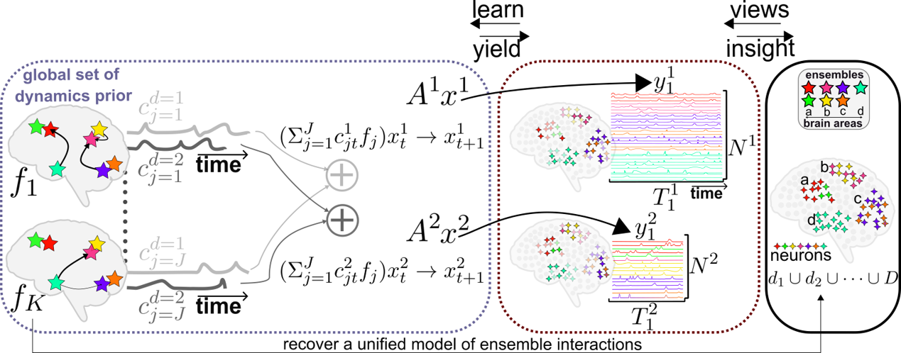

<div align="center">

# CREIMBO

### Cross-Regional Ensemble Interactions in Multi-view Brain Observations

**Learning shared, interpretable neural dynamics across multiple asynchronous, non-overlapping recording sessions**

[](https://openreview.net/forum?id=28abpUEICJ)
[](https://openreview.net/forum?id=28abpUEICJ)
[](https://www.python.org/)
[](https://pylops.readthedocs.io/)
<br>


[**Paper**](https://openreview.net/forum?id=28abpUEICJ) &middot; [**Install**](#installation) &middot; [**Quick start**](#quick-start) &middot; [**How it works**](#how-it-works) &middot; [**Data**](#data) &middot; [**Citation**](#citation)

</div>

---

## TL;DR

CREIMBO fits **one** interpretable model of brain-wide dynamics across neural recordings that **share no common neurons or brain areas**. It treats asynchronous, misaligned, multi-session recordings as diverse views of the same system, learns a set of **global sub-circuits** shared across sessions through graph-driven dictionary learning, and separates **session-invariant** dynamics from **session-specific** variation. Published at **ICLR 2025 (Spotlight)**.

<p align="center">
  
</p>

---

## Highlights

- **Multi-session by design.** No neuron-to-neuron correspondence across sessions required.
- **Interpretable.** A shared sub-circuit basis, not an opaque embedding.
- **Non-stationary.** Time-varying dynamics rather than a single fixed regime.
- **Global vs. session-specific.** Disentangles session-invariant computation from per-session variation.
- **Validated.** Recovers ground truth in synthetic data and reveals cross-subject dynamics in human high-density recordings.

---

## Installation

```bash
git clone https://github.com/NogaMudrik/CREIMBO_Cross_Regional_Ensemble_Interactions_in_Multi_view_Brain_Observations.git
cd CREIMBO_Cross_Regional_Ensemble_Interactions_in_Multi_view_Brain_Observations

# Python 3.9-3.10 recommended (pylops 1.18.2 requires numpy < 2)
pip install -r requirements.txt
```

`tkinter` is used for a file dialog and ships with most Python installs. On Debian/Ubuntu, install it with `sudo apt-get install python3-tk` if it is missing.

---

## Quick start

### Synthetic data (runs out of the box)

```bash
python run_CREIMBO.py
```

The script is interactive. When prompted `session num?!`, enter one of:

| Input | Meaning |
| --- | --- |
| `-1` | All sessions together (default CREIMBO setting) |
| `-2` | First 5 sessions |
| `0`, `1`, ... | A single session by index |

The default synthetic configuration (`type_synth = 'simplesimple'`) uses the ground-truth file in `synth_simple/`. Results are written to `./results/DEFAULT_res_.../`. To fit CREIMBO with its dynamics prior, keep `dynamics_prior = True` (the default in `run_CREIMBO.py`).

### Optional: regenerate the synthetic dataset

```bash
python synthetic_create_low_regions_simple_example4.py
```

---

## How it works

| Stage | What happens |
| --- | --- |
| **Inputs** | Multiple sessions with disjoint neuron sets and brain regions. |
| **Sub-circuits** | A shared global dictionary of ensemble-level interactions is learned via graph-driven dictionary learning. |
| **Composition** | Each session's dynamics are a sparse, time-varying mixture of the shared sub-circuits on a low-dimensional manifold. |
| **Decomposition** | Session-invariant dynamics are separated from session covariates and session-specific activations. |
| **Outputs** | Global sub-circuits `F`, per-session coefficients, latent dynamics, and the dictionary `D`, saved as a results dictionary. |

---

## Repository structure

| File / folder | Purpose |
| --- | --- |
| `main_CREIMBO.py` | Core model and all functions (entry function: `train_model_include_D`). |
| `run_CREIMBO.py` | Configures parameters, fits the model, and saves results. |
| `synthetic_create_low_regions_simple_example4.py` | Generates synthetic multi-region data. |
| `open_human_data_multi_regional_000469.py` | Loads and preprocesses the human dataset (see [Data](#data)). |
| `synth_simple/` | Provided synthetic ground-truth example. |
| `requirements.txt` | Python dependencies. |

---

## Data

The human recordings come from the Sternberg working-memory single-neuron dataset, DANDI archive [`000469`](https://dandiarchive.org/dandiset/000469):

> Kyzar M, Kaminski J, Brzezicka A, Reed CM, Chung JM, Mamelak AN, Rutishauser U. Dataset of human single-neuron activity during a Sternberg working memory task. *Scientific Data*. 2024;11(1):89. doi:10.1038/s41597-024-02943-8.

**To run on the human data:** download subject 10 from DANDI `000469`, then edit the hardcoded paths at the top of `open_human_data_multi_regional_000469.py` to point to your local copy. The script preprocesses spike times into Gaussian-smoothed firing-rate matrices used by the model.

---

## Citation

```bibtex
@inproceedings{mudrik2025creimbo,
  title={Creimbo: Cross-regional ensemble interactions in multi-view brain observations},
  author={Mudrik, Noga and Ly, Ryan and Ruebel, Oliver and Charles, Adam S},
  year={2025},
  organization={The International Conference on Learning Representations}
}
```

---

## Related work by the authors

- **dLDS**: Decomposed Linear Dynamical Systems for the latent components of neural dynamics (JMLR 2024).
- **SiBBlInGS**: Similarity-driven building-block inference using graphs across states (ICML 2024).

---

## License

No license file is currently included, which means default copyright applies. To let others use the code, add a `LICENSE` file (MIT is a common choice for research code) and update this section.

---

## Contact

Open a [GitHub issue](https://github.com/NogaMudrik/CREIMBO_Cross_Regional_Ensemble_Interactions_in_Multi_view_Brain_Observations/issues) or email **nmudrik1@jhu.edu**.

---

<!--
Keywords for search and indexing:
cross-session neural dynamics, multi-session, asynchronous recordings, non-overlapping neurons,
cross-region, multi-region brain dynamics, shared latent dynamics, session-invariant dynamics,
graph-driven dictionary learning, sub-circuits, neural ensembles, interpretable neural dynamics,
non-stationary dynamics, stitching neural recordings, unified model of neural dynamics,
computational neuroscience, dynamical systems, latent variable models, ICLR 2025 spotlight.
-->

<div align="center">
<sub><b>Keywords:</b> cross-session &middot; multi-session &middot; asynchronous recordings &middot; non-overlapping neurons &middot; cross-region dynamics &middot; shared latent dynamics &middot; graph-driven dictionary learning &middot; interpretable neural dynamics &middot; non-stationary dynamics &middot; computational neuroscience</sub>
</div>
